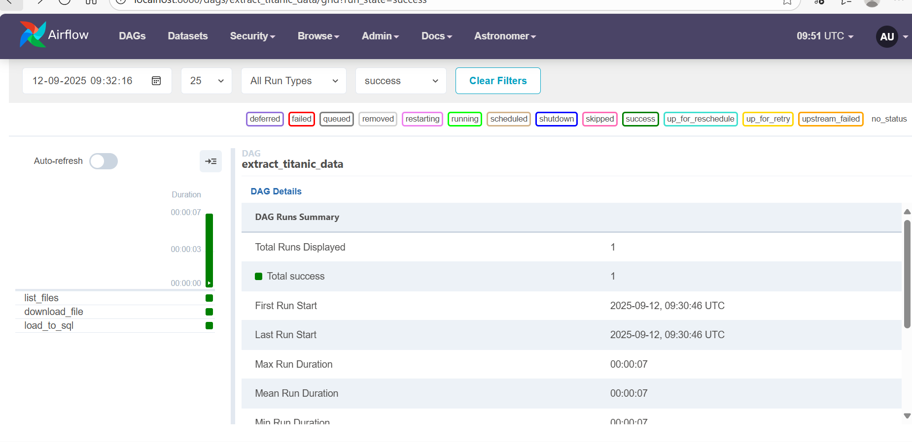

# 🚢 Titanic User Survival Prediction – MLOps Pipeline with Airflow, Redis, Grafana & Prometheus

**📌 Project Overview**

This project demonstrates a production-ready MLOps pipeline for predicting Titanic passenger survival, integrating data engineering, feature store management, drift detection, and ML monitoring.

Dataset: Titanic dataset uploaded to Google Cloud Storage (GCS).

Pipeline: Built with Astro Airflow, containerized via Docker, and orchestrated for ETL and ML workflows.

Database: Features stored in PostgreSQL and Redis (as feature store).

Monitoring: Real-time data drift detection with Alibi Detect and ML monitoring dashboards powered by Prometheus + Grafana.

Model Deployment: Flask-based UI for live user predictions.

Metric: Model achieves an accuracy of 0.80 on test data.

## 📹 Demo Video

👉 [Watch the project demo here](https://vimeo.com/1118501721)

---

**🔄 Workflow**
1. Data Engineering with Airflow

Extract Titanic dataset from GCS bucket.

Load into PostgreSQL for structured storage.

Containerized with Docker for portability.

2. Feature Store with Redis

Store processed features in Redis for efficient retrieval at training and prediction time.

Implemented using a custom RedisFeatureStore class with methods to:

Store features for individual or multiple entities.

Retrieve features by entity ID or batch.

List all stored entities.

3. Model Training & Versioning

Features retrieved from Redis → transformed & scaled.

RandomForest classifier trained on engineered features.

Model + code versioned via GitHub for reproducibility.

4. Flask Web App for Prediction

UI accepts user input (Age, Fare, Pclass, Sex, Embarked, FamilySize, etc.).

Model predicts survival probability.

Prediction results displayed in the browser.

5. Data Drift Detection

Drift detection powered by Alibi Detect (KSDrift).

Reference data: stored training dataset from feature store.

Current data: live user inputs via Flask UI.

Drift events logged and monitored in Prometheus.

6. ML Monitoring with Prometheus & Grafana

Prometheus:

Collects metrics (prediction_count, drift_count).

Exposes metrics via /metrics endpoint in Flask.

Grafana:

Visualizes prediction and drift metrics.

Dashboards for monitoring ML system health.

7. Local Monitoring & CICD

Attempted CI/CD with Jenkins + Google Cloud Run, but due to quota limits, monitoring was deployed locally.

Still demonstrates full ML observability pipeline.

---------------------

        ┌──────────────┐
        │ Google Cloud │
        │   Storage    │
        └──────┬───────┘
               │
        ┌──────▼───────┐
        │   Airflow    │
        │  (Docker)    │
        └──────┬───────┘
               │
        ┌──────▼───────┐
        │ PostgreSQL   │
        └──────┬───────┘
               │
        ┌──────▼───────┐
        │   Redis      │  ← Feature Store
        └──────┬───────┘
               │
        ┌──────▼──────────┐
        │ Flask Web App   │
        │  User Input UI  │
        └──────┬──────────┘
               │
     ┌─────────▼─────────┐
     │ Drift Detection    │
     │ (Alibi Detect)     │
     └─────────┬─────────┘
               │
        ┌──────▼───────┐
        │ Prometheus   │ ← Metrics collection
        └──────┬───────┘
               │
        ┌──────▼───────┐
        │  Grafana     │ ← Dashboards
        └──────────────┘

-------------
**Tech Stack**

Data Orchestration: Apache Airflow (Astro)

Storage: Google Cloud Storage, PostgreSQL

Feature Store: Redis

Modeling: scikit-learn (RandomForest Classifier)

Deployment: Flask, Docker

Monitoring: Prometheus, Grafana, Alibi Detect

Versioning: GitHub (code + dataset versioning)

CI/CD (attempted): Jenkins, GCP

--------------

**📊 Metrics & Monitoring**

Prediction Count (prediction_count) → Total number of predictions made.

Drift Count (drift_count) → Number of times data drift detected.

Accuracy: 0.80 on test dataset.

Grafana Dashboards:

Prediction activity over time.

Drift detection alerts.

Custom Prometheus metrics visualization. 

----
## 📡 Airflow Orchestration

The data pipeline is orchestrated using **Apache Airflow**.  
Below is a screenshot of the `extract_titanic_data` DAG successfully running all tasks (`list_files`, `download_file`, `load_to_sql`):

